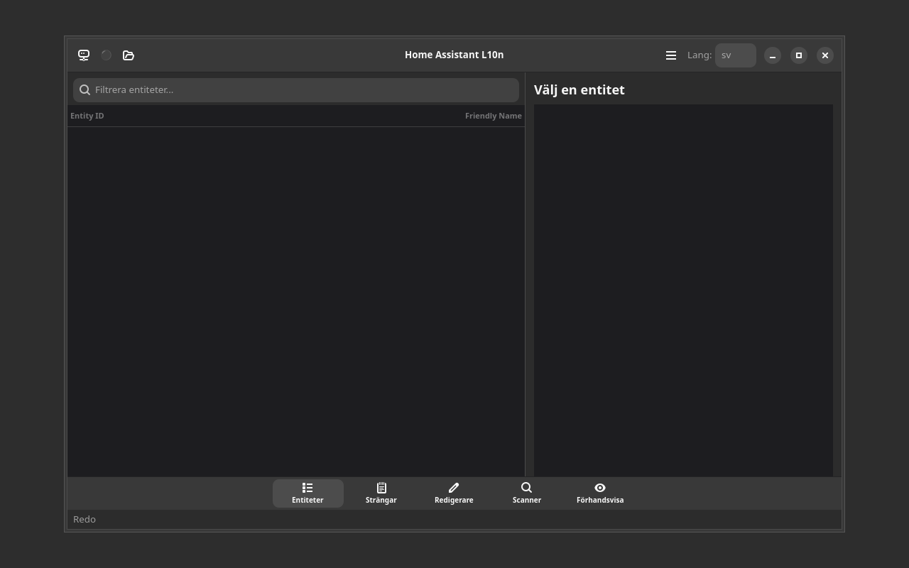

# Home Assistant L10n

[](https://github.com/yeager/ha-l10n/releases)

## Screenshot



[](https://www.gnu.org/licenses/gpl-3.0)
[](https://www.transifex.com/danielnylander/ha-l10n/)

Home Assistant translation status dashboard - a GTK4/Libadwaita application that provides a dashboard for monitoring Home Assistant translation status across different languages.

## Features

- Modern GTK4/Libadwaita interface
- Translation status monitoring
- Multi-language support via Transifex
- Keyboard shortcuts support
- Cross-platform compatibility

## Installation

### From Source
```bash
git clone https://github.com/yeager/ha-l10n.git
cd ha-l10n
pip install -e .
```

### Debian/Ubuntu
Download the latest `.deb` package from the [releases page](https://github.com/yeager/ha-l10n/releases).

### Fedora/RHEL
Download the latest `.rpm` package from the [releases page](https://github.com/yeager/ha-l10n/releases).

## Usage

Launch the application:
```bash
ha-l10n
```

### Keyboard Shortcuts
- `Ctrl+Q` - Quit application
- `F5` - Refresh data
- `Ctrl+?` - Show keyboard shortcuts

## Translation

Help translate this application on [Transifex](https://www.transifex.com/danielnylander/ha-l10n/).

## Author

**Daniel Nylander**
- Email: daniel@danielnylander.se
- GitHub: [@yeager](https://github.com/yeager)

## License

This project is licensed under the GPL-3.0-or-later License - see the [LICENSE](LICENSE) file for details.